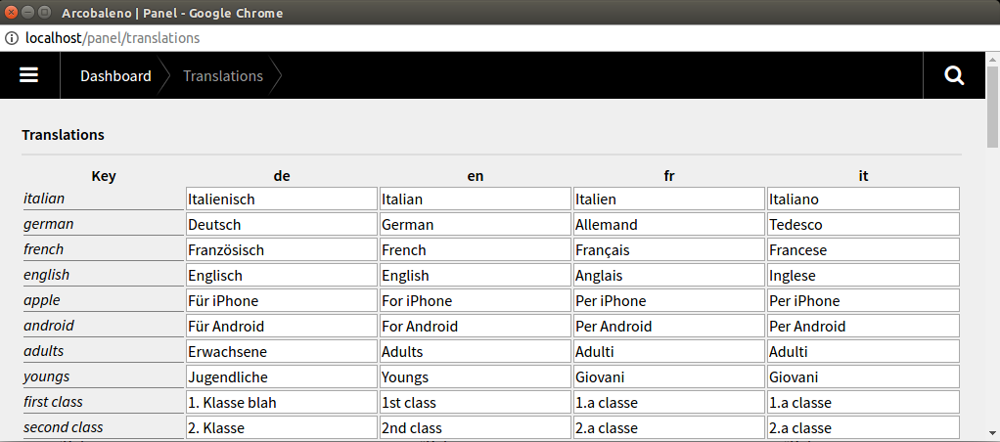

#Kirby translations plugin

version 0.0.1

A plugin for the Kirby 2 CMS. It allows you to view, complete and correct translation entries of the `site/languages/*.php` files via the panel. 



##Attention
This plugin works by deleting and rewriting your files in `site/languages/`. Anything other than `l::set()` calls will be lost. 

User input will be mapped to PHP's `addslashes` method, the plugin will do no other escaping (a user could therefore enter HTML code, including potentially dangerous `<script>` tags).

##Compatibility
This plugin has been tested with Kirby 2.3.2.

##Installation

### Kirby CLI

If you are using the Kirby CLI you can install this field plugin by running the following command in your shell from the root folder of your Kirby installation:

```
kirby plugin:install rasteiner/kirbytranslations
```

### Manual

Download the repository, extract it into the `site/plugins` folder, then rename the extracted folder to "translations".

##Usage
 - Install the plugin
 - Have something in your `site/languages/` folder
 - In your browser open `hostname/panel/translations`
 - Edit the text in shown table
 - Save by clicking the save button below


